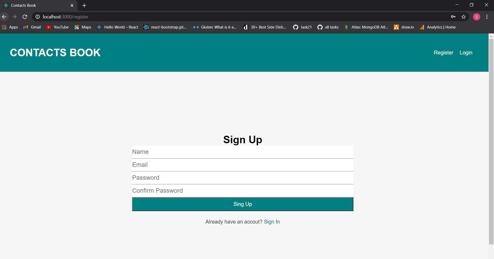
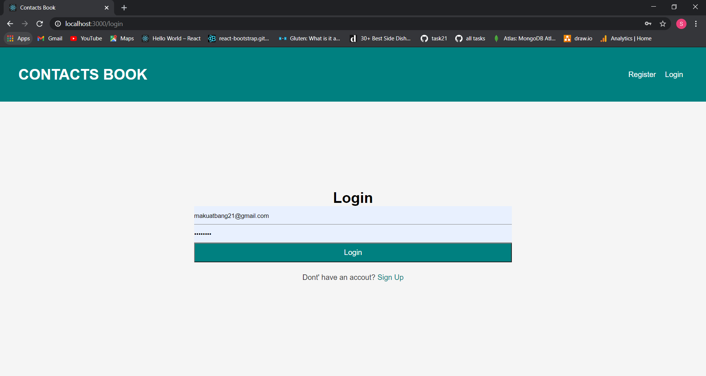
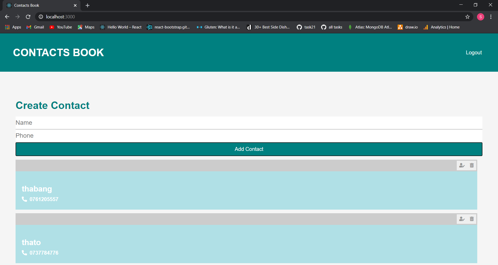

Software Requirements Specification And Planning

Scope:
This is a documentation for my project application, this application is a contacts book app and is meant to store,update anad delete contacts.
Goal:
The Objective of this application:

• Users should be able to Register and login to contacts page
• Users should be able to create,update and delele contacts
• User should be search contacts by name
• Users should be able to logout of the app

Tools:

Developer description of the website
In this application I will be using the following tools:
Backend: - Node js, express, mongodb
Frontend: - React and bootstrap

details
• Authentication – create user register, login and logout page. 
• Maintain contents - create, view, update and delete contacts.
• Schema –
o Name, email and password
• Search - user shall be able to create,update and delete data.
Edit – clicking on update button will allow to update user contacts

Lists of functional and non-functional requirements for the website application
Functional requirements

1. The system must have a form to register and login user.
2. The system should be able to store contacts.
3. The system should be able to display all contacts to users that is signed in.
4. The system should option to logout once logged in.

Non-functional requirements

1. System should allow for users to update contacts.
2. All visitors to the website should only be able to register and save there contacts.

Users Story cards
Mentor to comment … as my stake holder

//Running the app
#Note, before running the app replace the MONGODB_URL connect link from the .env file in order to connect to your database.

1. To Run this app - install node_modules from the command line , use "npm install" on the server and then "cd client" and install the node modules on the client folder as well
2. place your mongoDB connectuin string on .env txt
3. place your mongoDB connectuin string on production.json 
4. "npm run start" on server folder to run the server
5. "npm run start" on client folder to run the the front end
6. Once the app is loaded, click on register at the right hand corner of the screen to register your account.
7. after registering you will be taken to the login screen where you can enter your email and password that you have chosen, the you will be logged in
8. form the dashboard you can start creating and saving your contacts

App security

• Helmet is used to ensure security of this app

## Register page
 

## Login page
 

## Home page
 
